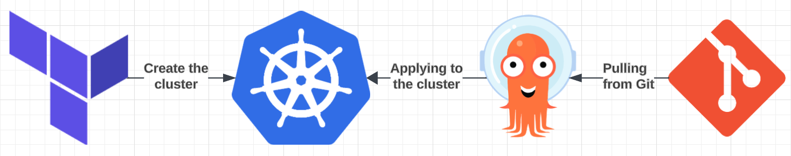
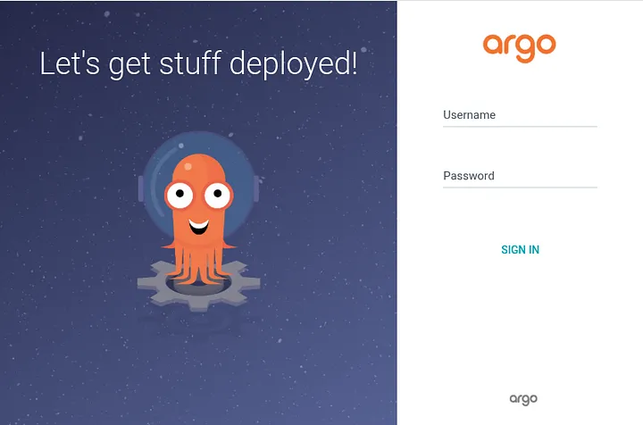
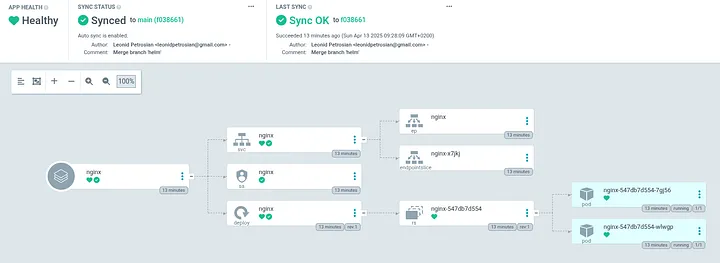

# **Kubernetes GitOps Deployment with ArgoCD and Helm on GCP**



## **Introduction: Why GitOps?**

As modern applications grow in complexity, managing Kubernetes deployments manually becomes a challenge. Traditional deployment strategies often rely on imperative commands (`kubectl apply`, `helm install`), which can lead to:

- **Drift between environments** – Changes applied manually in staging may not match production.
- **Lack of visibility** – No single source of truth for deployment history.
- **Rollback challenges** – Reverting a bad deployment is not straightforward.

### **What is GitOps?**

GitOps is a **declarative** approach to managing Kubernetes applications, where:

- The **Git repository is the single source of truth** for all deployments.
- Any change to Kubernetes manifests in Git is automatically **applied and reconciled** in the cluster.
- Rollbacks and disaster recovery are as simple as reverting a commit in Git.

### **Key Benefits of GitOps**

- **Automated, consistent deployments** – No manual `kubectl` commands.
- **Rollback with Git history** – Deploy any previous version by reverting a commit.
- **Increased security** – All changes must go through Git, providing **auditability**.
- **Self-healing infrastructure** – If someone modifies Kubernetes resources manually, GitOps corrects the drift.

### **Why ArgoCD?**

ArgoCD is a **Kubernetes-native GitOps tool** that continuously syncs application manifests from Git to Kubernetes. It provides:

- **Automated deployments** from Git.
- **Real-time monitoring** of application status.
- **Multi-cluster support** for managing multiple environments.

---

## **1. Setting Up the GKE Cluster with Terraform**

We'll start by provisioning a **GKE cluster** using **Terraform**, ensuring infrastructure is managed as code.

### **1.1. Define Terraform Configuration**

Let’s organize our Terraform code. Create a folder structure like this:

```
terraform/
├── gke.tf
├── outputs.tf
├── providers.tf
├── variables.tf
├── vpc.tf
```

Instead of using the default VPC, we’ll define our own network with isolated subnet for our GKE workload (`vpc.tf`):

```hcl
# VPC
resource "google_compute_network" "vpc" {
  project                 = var.project_id
  name                    = "${var.project_id}-vpc"
  auto_create_subnetworks = "false"
}

# Subnet
resource "google_compute_subnetwork" "subnet" {
  project       = var.project_id
  name          = "${var.project_id}-subnet"
  region        = var.region
  network       = google_compute_network.vpc.name
  ip_cidr_range = "10.10.0.0/24"
}

```

With networking in place, it’s time to spin up a GKE cluster (`gke.tf`):

```hcl
# GKE cluster
resource "google_container_cluster" "primary" {
  project  = var.project_id
  name     = "${var.project_id}-gke"
  location = var.region

  # We can't create a cluster with no node pool defined, but we want to only use
  # separately managed node pools. So we create the smallest possible default
  # node pool and immediately delete it.
  remove_default_node_pool = true
  initial_node_count       = 1

  network    = google_compute_network.vpc.name
  subnetwork = google_compute_subnetwork.subnet.name
}

resource "google_container_node_pool" "primary_nodes" {
  project  = var.project_id
  name     = google_container_cluster.primary.name
  location = var.region
  cluster  = google_container_cluster.primary.name

  node_count = var.gke_num_nodes

  node_config {
    oauth_scopes = [
      "https://www.googleapis.com/auth/logging.write",
      "https://www.googleapis.com/auth/monitoring",
    ]

    preemptible  = true
    machine_type = "n1-standard-1"
  }
}
```

### **1.2. Deploy the Cluster**

First authenticate with your GCP account:

```sh
gcloud auth application-default login
```

Initialize and apply Terraform:

```sh
terraform init
terraform apply -auto-approve
```

Once done, configure `kubectl`:

```sh
gcloud container clusters get-credentials primary-cluster --region us-central1
```

Verify cluster status:

```sh
kubectl get nodes
```

---

## **2. Installing and Configuring ArgoCD**

Now that our GKE cluster is up and running inside a secure VPC, it’s time to introduce ArgoCD — the heart of our GitOps workflow.

### **2.1. Install ArgoCD**

We’ll install ArgoCD into a separate namespace using the official Kubernetes manifests provided by the ArgoCD team:

```sh
kubectl create namespace argocd
kubectl apply -n argocd -f https://raw.githubusercontent.com/argoproj/argo-cd/stable/manifests/install.yaml
```

This command:

- Installs all ArgoCD components: API server, controller, repo-server, and UI
- Sets up RBAC roles and required services
- Starts watching the cluster for Git-sourced application configs

### **2.2. Expose the ArgoCD Server**

By default, the ArgoCD API server is only exposed internally within the cluster. We’ll expose it using a LoadBalancer service for easy access:

```sh
kubectl patch svc argocd-server -n argocd -p '{"spec": {"type": "LoadBalancer"}}'
```

Now wait a minute or two and get the external IP:

```sh
kubectl get svc argocd-server -n argocd
```

Copy the `EXTERNAL-IP` value — that’s your ArgoCD dashboard URL (`https://EXTERNAL-IP`).



### **2.3. Retrieve ArgoCD Admin Password**

To log into the ArgoCD UI, you’ll need the admin password, which is stored as a Kubernetes secret:

```sh
kubectl -n argocd get secret argocd-initial-admin-secret -o jsonpath="{.data.password}" | base64 -d
```

Username: `admin`
Password: (output from above)

Open your browser, go to `https://EXTERNAL-IP`, and log in with these credentials.

⚠️ Important: This is a default password. For production, you must change it immediately or integrate ArgoCD with an identity provider (e.g. Google, GitHub, SSO).

Login via CLI:

```sh
argocd login <EXTERNAL-IP>
```

### **2.4. Connect ArgoCD to Your Git Repository**

ArgoCD works by syncing applications defined in Git repos to your cluster. Let’s connect your GitHub repo next.

Step 1: Add your Git repository
Replace `YOUR_REPO_URL` with your actual repository URL:

```bash
argocd repo add https://github.com/YOUR_REPO_URL\
 --username your-username \
 --password your-password
```

Or, if you're using SSH:

```bash
argocd repo add git@github.com:YOUR_USER/YOUR_REPO.git \
 --ssh-private-key-path ~/.ssh/id_rsa
```

💡 You can also do this via the UI under Settings > Repositories.

---

## **3. Setting Up GitOps with Helm**

Now that ArgoCD is installed and connected to your Git repository, it’s time for the real magic — deploying applications using Helm charts, the GitOps way.

In this step, we’ll create a sample application, define its configuration in Git, and let ArgoCD take care of deploying and maintaining it in your GKE cluster.

### **3.1. Define Git Repository Structure**

For this example, we’ll use a default NGINX Helm chart. If you don’t have this already, let’s generate it:

```bash
helm create nginx
```

It should create the basic structure of a Helm chart

```
charts/
├── nginx/
│   ├── Chart.yaml
│   ├── values.yaml
│   ├── templates/
│       ├── deployment.yaml
│       ├── service.yaml
            ...
```

Commit this directory into your Git repository.

### **3.2. Define ArgoCD Application Manifest**

This is how you tell ArgoCD, “Please watch this path in Git and keep the cluster in sync.”

Create a file in your repo at `argocd/nginx.yaml`:

```yaml
apiVersion: argoproj.io/v1alpha1
kind: Application
metadata:
  name: nginx
  namespace: argocd
spec:
  project: default
  destination:
    namespace: nginx
    server: https://kubernetes.default.svc
  source:
    repoURL: https://github.com/your-org/gitops-repo.git
    targetRevision: main
    path: charts/nginx
    helm:
      values: |
        service:
          type: LoadBalancer
        replicaCount: 2
  syncPolicy:
    automated:
      prune: true
      selfHeal: true
```

Once the manifest is ready, push it to your main branch.

If you’re using an **App of Apps** pattern, ArgoCD will pick it up automatically. If not, apply it manually:

```bash
kubectl apply -f argocd/nginx.yaml
```

Then check it in ArgoCD:

```bash
argocd app get nginx
```

Within a minute, you should see the NGINX deployment go live in the nginx namespace.



---

## **Conclusion**

We successfully implemented **GitOps with ArgoCD and Helm** on **Google Kubernetes Engine (GKE)**, enabling:

- **Automated deployments** from Git.
- **Rollback and history tracking** using Git commits.
- **Self-healing infrastructure** through ArgoCD sync policies.

This setup is **scalable** and can be extended with **progressive delivery (Canary, Blue-Green), security policies, and secrets management (Vault)**.
